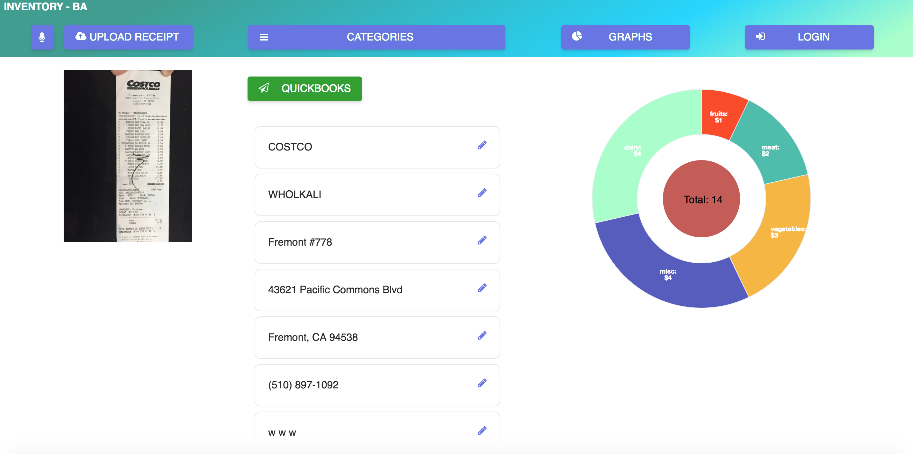

## INVENTORY

This is a project built during a hackathon at Intuit SmallBizHack. 
The live version of this app is available here. [https://inventory-ba.herokuapp.com/](https://inventory-ba.herokuapp.com/).

1. [Members](#members)
2. [Requirements](#requirements)
3. [Development](#development)
    1. [Steps to start](#steps-to-start)
    1. [Things to do](#things-to-do)

## Members
- Phong Lam
- Albert Kao
- Eric Lin
- Elliot Z. Lin

## Requirements
- Node 8.1.4
- React 16.0.0
- Victory 0.24.1

## Development

### Steps to start:
1. npm install to install dependencies.
2. npm start: will start the server (on localhost:3000)
3. Open your browser and goto localhost:3000, the app should be there.
4. Happy coding!

### Things to do:
- Create more models to accept more than just Costco
- Integrate more with QuickBooks API
